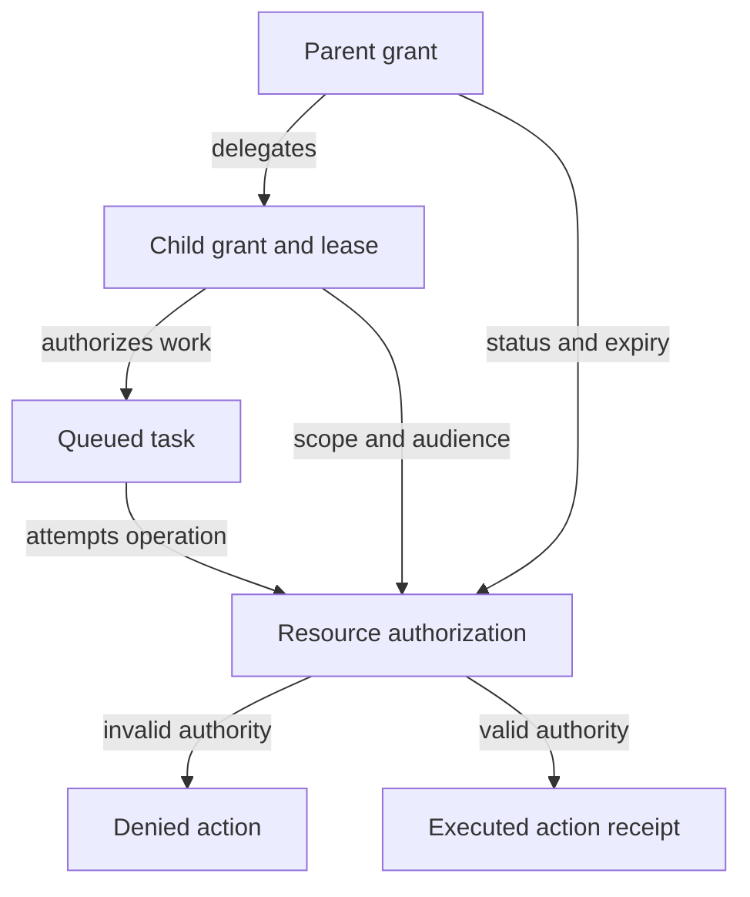

# AI forensic readiness: authority and evidence boundaries

## Distinct identity with parent-bound authority

<!-- mermaid:id=authority-lifecycle -->


## Execution proof and missing influence

<!-- mermaid:id=evidence-boundary -->
```mermaid
flowchart TB
  provider["Provider context gap"]
  gateway["Gateway request"]
  resource["Resource receipt"]
  graph["Evidence-linked reconstruction"]
  unknown["Influence remains unknown"]
  confirmed["Execution supported"]
  provider -.->|missing context| graph
  gateway -->|request identifier| resource
  gateway -->|request evidence| graph
  resource -->|state evidence| graph
  graph -->|scope the gap| unknown
  graph -->|join receipts| confirmed
%% portable-canonical-v2:eyJhY2Nlc3NpYmlsaXR5IjpudWxsLCJkYXRhIjp7ImRpcmVjdGlvbiI6IlRCIiwiZWRnZXMiOlt7ImFycm93IjoiLS4tPiIsImZyb20iOiJwcm92aWRlciIsImxhYmVsIjoibWlzc2luZyBjb250ZXh0IiwidG8iOiJncmFwaCJ9LHsiZnJvbSI6ImdhdGV3YXkiLCJsYWJlbCI6InJlcXVlc3QgaWRlbnRpZmllciIsInRvIjoicmVzb3VyY2UifSx7ImZyb20iOiJnYXRld2F5IiwibGFiZWwiOiJyZXF1ZXN0IGV2aWRlbmNlIiwidG8iOiJncmFwaCJ9LHsiZnJvbSI6InJlc291cmNlIiwibGFiZWwiOiJzdGF0ZSBldmlkZW5jZSIsInRvIjoiZ3JhcGgifSx7ImZyb20iOiJncmFwaCIsImxhYmVsIjoic2NvcGUgdGhlIGdhcCIsInRvIjoidW5rbm93biJ9LHsiZnJvbSI6ImdyYXBoIiwibGFiZWwiOiJqb2luIHJlY2VpcHRzIiwidG8iOiJjb25maXJtZWQifV0sIm5vZGVzIjpbeyJpZCI6InByb3ZpZGVyIiwibGFiZWwiOiJQcm92aWRlciBjb250ZXh0IGdhcCJ9LHsiaWQiOiJnYXRld2F5IiwibGFiZWwiOiJHYXRld2F5IHJlcXVlc3QifSx7ImlkIjoicmVzb3VyY2UiLCJsYWJlbCI6IlJlc291cmNlIHJlY2VpcHQifSx7ImlkIjoiZ3JhcGgiLCJsYWJlbCI6IkV2aWRlbmNlLWxpbmtlZCByZWNvbnN0cnVjdGlvbiJ9LHsiaWQiOiJ1bmtub3duIiwibGFiZWwiOiJJbmZsdWVuY2UgcmVtYWlucyB1bmtub3duIn0seyJpZCI6ImNvbmZpcm1lZCIsImxhYmVsIjoiRXhlY3V0aW9uIHN1cHBvcnRlZCJ9XX0sImRlc2NyaXB0aW9uIjpudWxsLCJpZCI6ImV2aWRlbmNlLWJvdW5kYXJ5Iiwia2luZCI6ImZsb3djaGFydCIsInNvdXJjZVNoYTI1NiI6IjQ4NmIwNmYyZGJjN2JlODc1NThmYmMxYzEyYmFiMzcyYjA0MDhhNjgzYjQwMjljNjZiY2ZiZDhlNWNkOTM0MjkiLCJzdHlsZXMiOltdLCJ0aXRsZSI6IkV4ZWN1dGlvbiBwcm9vZiBhbmQgbWlzc2luZyBpbmZsdWVuY2UiLCJ2ZXJzaW9uIjoxfQ
```
