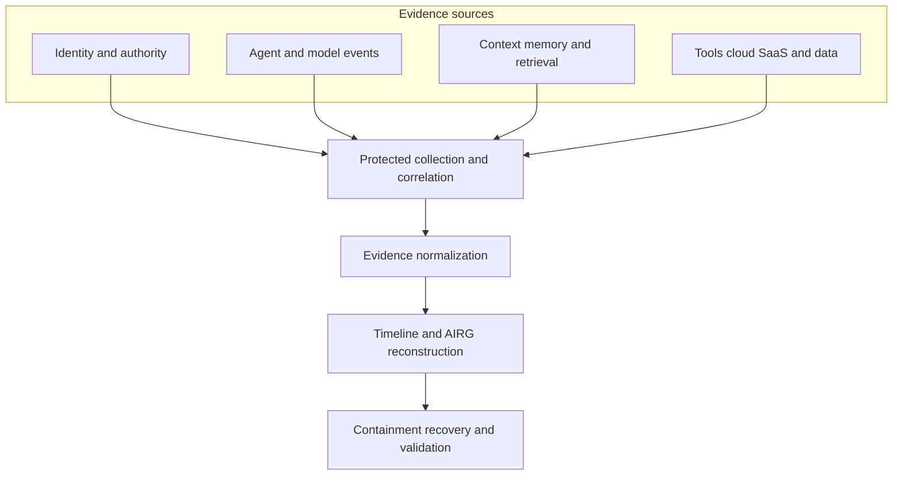
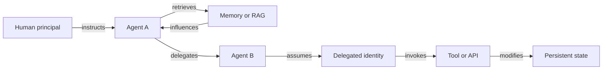
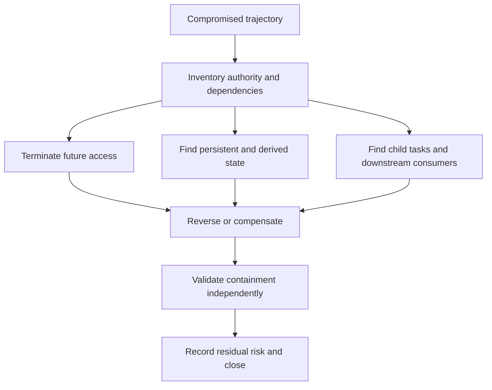

# AI Forensic Readiness architecture diagrams

Portable discussion-draft diagrams for the evidence path, consequential action chain, and containment workflow.

## AI forensic-readiness evidence path

<!-- mermaid:id=evidence_path -->

## Consequential action chain

<!-- mermaid:id=action_chain -->

## Dependency-aware containment

<!-- mermaid:id=containment -->

