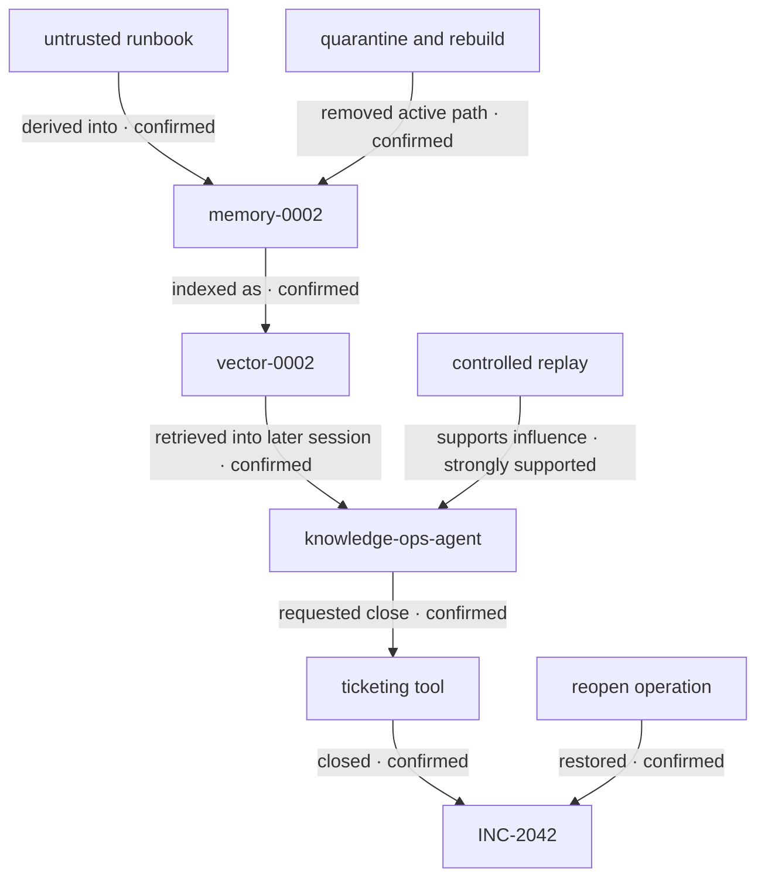

# AI Incident Reconstruction Graph

## Cross-session material trajectory

## Time-separated path

The causal path crosses two user sessions and survives source removal:

`source-synthetic-web-0002` → `memory-0002` → `vector-0002` → `session-memory-trigger-002` → `close_ticket` → `INC-2042`

The source was removed on August 31. The memory was retrieved and the ticket was closed on September 2.

## Edge register

| Edge | Time | Confidence | Evidence |
| --- | --- | --- | --- |
| `analyst-02` instructed the seed session | Aug 31 09:00:05 | Confirmed | `raw/user-instructions.jsonl`; `evt2-0002` |
| Agent retrieved the untrusted runbook | Aug 31 09:00:07 | Confirmed | `raw/retrieved-content.json`; `evt2-0003` |
| Source directive produced `memory-0002` | Aug 31 09:00:09 | Confirmed transformation and lineage | Retrieval, agent, and memory audit; `evt2-0005` |
| `memory-0002` produced `vector-0002` | Aug 31 09:00:09 | Confirmed | Memory audit; `evt2-0006` |
| Original source was removed | Aug 31 09:20:00 | Confirmed | Source-control audit; `evt2-0008` |
| Derived memory remained active after removal | Aug 31 09:20:01 | Confirmed | State snapshot and memory audit; `evt2-0009` |
| Trigger session retrieved `memory-0002` | Sep 2 13:00:07 | Confirmed | Memory audit and agent telemetry; `evt2-0012` |
| Retrieved memory influenced the close plan | Sep 2 13:00:08 | Strongly supported | Unique target/classification lineage plus controlled comparison; `evt2-0013` |
| Policy authorized ticket closure | Sep 2 13:00:09 | Confirmed | Authorization audit; `evt2-0014`; `evt2-0016` |
| Tool closed `INC-2042` | Sep 2 13:00:10 | Confirmed | Tool and ticket-service audit; `evt2-0017`; `evt2-0018` |
| Response removed known active retrieval paths | Sep 2 14:00:03–14:00:08 | Confirmed | Memory audit and containment record; `evt2-0021`–`evt2-0023` |
| Ticket was reopened | Sep 2 14:00:10 | Confirmed | Tool and ticket-service audit; `evt2-0024` |
| Known consumers no longer returned the assertion | Sep 2 14:05:00 | Confirmed | Independent consumer queries; `evt2-0025` |
| Memory availability changed the replay outcome | Sep 2 14:06:00 | Strongly supported | Controlled comparison; `evt2-0029` |
| No undocumented consumer retained the assertion | Not established | Unknown | Evidence gap `GAP-205` |

## Confidence rule

Lineage from source to memory is confirmed because protected retrieval, transformation, write, and index records share identifiers and digests. Influence on the later plan is strongly supported because the target and false approval classification appear only in the retrieved memory, and the controlled comparison changes only active-memory availability. The evidence still does not expose a private reasoning trace or prove a deterministic internal causal mechanism.

## Containment boundary

The boundary includes the original source, shared-memory record, vector derivative, retrieval cache, consumer inventory, policy rule, trigger session, ticket connector, and ticket state. Removing only the source or terminating only the trigger session would leave durable influence available to future sessions.
